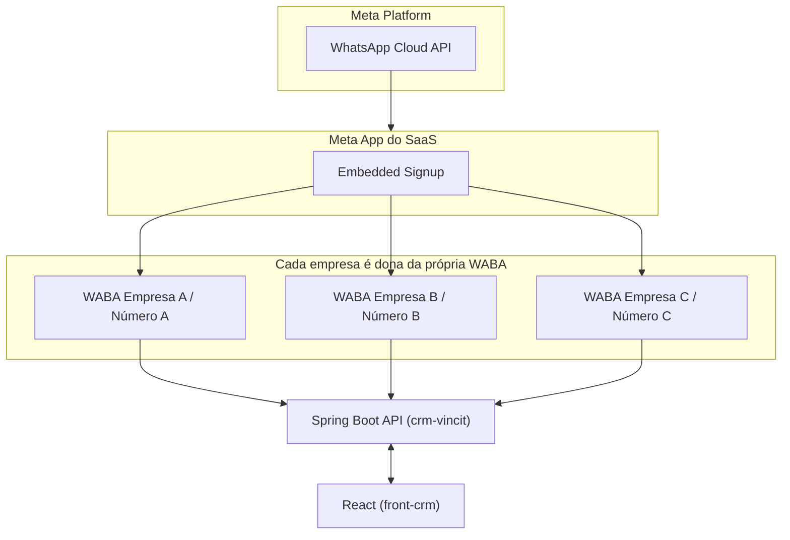
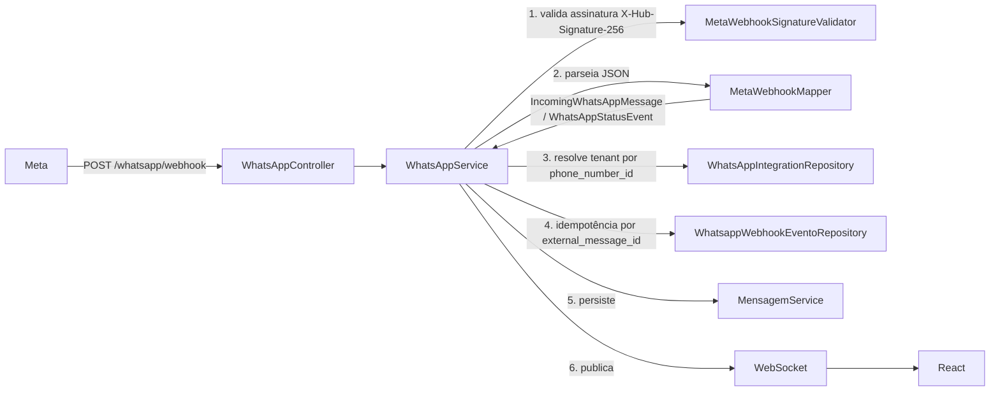

# Arquitetura — WhatsApp via Meta Cloud API

Este documento descreve a arquitetura da integração WhatsApp após a migração completa de Twilio
para a **Meta WhatsApp Cloud API**. Não há mais nenhuma dependência de Twilio no projeto — cada
empresa (tenant) do CRM conecta seu próprio número/WABA através de Embedded Signup.

## Visão geral



Cada empresa mantém sua própria `WhatsAppIntegration` (1:1, tabela `whatsapp_integration`) com
`waba_id`, `phone_number_id`, `access_token_encrypted`. Nunca existe uma WABA compartilhada entre
empresas — ver `docs/whatsapp/EMBEDDED_SIGNUP.md`.

## Fluxo de saída (envio)

```mermaid
flowchart LR
    React -->|POST /whatsapp/send| WhatsAppController
    WhatsAppController --> WhatsAppService
    WhatsAppService -->|resolve integração da empresa via TenantContext| WhatsAppIntegrationRepository
    WhatsAppService --> MetaWhatsAppClient
    MetaWhatsAppClient -->|POST /{phone-number-id}/messages| GraphAPI["Graph API"]
```

- `WhatsAppService.sendWhatsAppMessage` é o único ponto de envio de texto/mídia (chamado tanto por
  `WhatsAppController` quanto por `ChatService`, usado pelo chat STOMP).
- `MetaWhatsAppClient` é a única classe que fala HTTP com a Graph API — nenhum outro service
  monta URL ou usa `RestClient`/`WebClient` diretamente.
- O retorno é sempre um DTO interno (`WhatsAppSendResultDTO`), nunca o JSON cru da Meta.

## Fluxo de entrada (webhook)



Diferença importante em relação ao antigo fluxo Twilio: a Twilio exigia um Auth Token **por
empresa**, então o tenant precisava ser resolvido **antes** de validar a assinatura. A Meta usa um
único App Secret para o App inteiro do SaaS — por isso aqui a assinatura é validada **antes** de
qualquer resolução de tenant, o que é mais simples e mais seguro (uma requisição forjada nem chega
a tocar dados de nenhuma empresa).

## Classes principais

| Camada | Classe | Responsabilidade |
|---|---|---|
| Controller | `WhatsAppController` | `/whatsapp/send`, `/whatsapp/send-template`, `/whatsapp/webhook` (GET verify + POST evento) |
| Controller | `WhatsAppIntegrationController` | `/empresa/whatsapp-integration` (status, connect, disconnect, meta-config) — autoatendimento, ROLE_ADMIN, empresa resolvida pelo usuário autenticado |
| Service | `WhatsAppService` | Envio, recebimento de webhook, resolução de tenant, idempotência, status de mensagem |
| Service | `WhatsAppIntegrationService` | Conectar/desconectar a integração de uma empresa (Embedded Signup) |
| Infra | `MetaWhatsAppClient` | Toda chamada HTTP à Graph API (mensagens, mídia, templates, OAuth, subscribe) |
| Infra | `MetaWebhookMapper` | Traduz o JSON bruto do webhook para `IncomingWhatsAppMessage`/`WhatsAppStatusEvent` |
| Infra | `MetaWebhookSignatureValidator` | Valida `X-Hub-Signature-256` (HMAC-SHA256 com o App Secret) |
| Infra | `MetaWhatsAppProperties` | Config centralizada (`meta.whatsapp.*` / `META_*`) |
| Domínio | `WhatsAppIntegration` | Entidade JPA — integração de uma empresa (substitui `EmpresaTwilioConfig`) |
| Domínio | `IncomingWhatsAppMessage`, `WhatsAppStatusEvent` | Records internos, desacoplados do JSON da Meta |
| Domínio | `MessageStatus`, `WhatsAppIntegrationStatus` | Enums internos — o resto do sistema nunca depende dos valores crus da Meta |

## Decisões de arquitetura registradas

1. **Uma única chave de criptografia** (`APP_ENCRYPTION_KEY` / `app.encryption.key`) é reaproveitada
   para o `accessToken` da Meta, em vez de introduzir uma segunda variável `META_TOKEN_ENCRYPTION_KEY`
   dedicada. `EncryptedStringConverter` (AES/GCM) já era genérico — não específico da Twilio —
   então manter uma única chave/mecanismo de criptografia em repouso para todo o projeto evita
   duplicar segredo e rotação. Se no futuro for necessário isolar chaves por tipo de segredo, essa
   decisão pode ser revisitada.
2. **Sem client cacheado por empresa.** O antigo `TwilioClientProvider` cacheava um
   `TwilioRestClient` por empresa porque o SDK da Twilio exigia um client construído com
   accountSid/authToken. A Meta é uma API REST simples: `MetaWhatsAppClient` é um único bean
   stateless compartilhado por todos os tenants, e o `accessToken` vai como parâmetro em cada
   chamada — não há nada para cachear por empresa.
3. **Idempotência reaproveitada quase 1:1.** A tabela `whatsapp_webhook_evento` (antes indexada por
   `message_sid`) passou a indexar por `external_message_id` (wamid da Meta), mantendo a mesma
   estratégia: registrar o id **antes** do processamento pesado, para que um reenvio do mesmo
   webhook esbarre na constraint `UNIQUE` em vez de duplicar processamento.
4. **Status de mensagem é um recurso novo.** O fluxo Twilio nunca rastreou status de entrega. Os
   campos `mensagem.external_message_id`/`mensagem.status` são novos (ver migration
   `V2026.08.13.10.30.00`), atualizados pelo webhook de status da Meta (`sent`/`delivered`/`read`/`failed`)
   e refletidos na UI como ticks (✓/✓✓/✓✓ azul).

## Limitações conhecidas

Ver `docs/whatsapp/TROUBLESHOOTING.md` para os pontos que precisam de atenção manual (formato de
número de celular herdado do fluxo Twilio, ausência de UI de gestão de templates, etc.).
