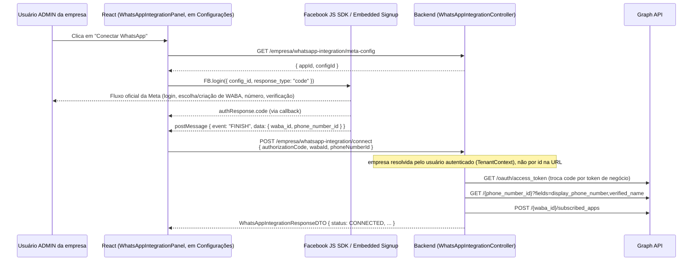

# Embedded Signup — fluxo de conexão por empresa

Como cada empresa-cliente conecta seu próprio WhatsApp (WABA + número) ao CRM, sem nunca
compartilhar credenciais com o SaaS ou com outras empresas.

## Onde vive no produto

Tela: **Configurações → "Integração WhatsApp (Meta Cloud API)"**
(`front-crm/src/components/organisms/WhatsAppIntegrationPanel.tsx`, dentro de `SettingsPage`,
mesma tela de autoatendimento onde a empresa já edita nome/logo/notificações). Visível e utilizável
apenas por `ROLE_ADMIN` — cada empresa conecta o **próprio** número, sem depender do usuário
master. O backend resolve a empresa a partir do usuário autenticado (`TenantContext`), nunca de um
id na URL — por isso não existe mais rota `/master/empresas/{id}/whatsapp-integration`.

## Passo a passo (visão do usuário)

## Por que dois pedaços de informação chegam separados

A própria Meta divide o retorno do Embedded Signup em dois canais diferentes:

1. **`authorizationCode`** — vem do callback padrão de `FB.login()`
   (`response.authResponse.code`), o mecanismo OAuth normal do Facebook Login.
2. **`wabaId` / `phoneNumberId`** — vêm de um evento `message` disparado pela própria janela do
   Embedded Signup (`window.postMessage`), com `data.type === "WA_EMBEDDED_SIGNUP"` e
   `data.event === "FINISH"`. Isso é específico do widget de Embedded Signup, não do OAuth padrão.

`src/lib/metaEmbeddedSignup.ts` (`launchEmbeddedSignup`) escuta os dois canais e só resolve a
Promise quando ambos chegaram — é o que é enviado para `POST .../whatsapp-integration/connect`.

## O que o backend faz ao "conectar" (`WhatsAppIntegrationService.conectar`)

1. Marca a integração como `CONNECTING` (salva imediatamente, para a tela já refletir o estado
   intermediário caso algo demore).
2. Troca `authorizationCode` por um **token de acesso de negócio** via
   `MetaWhatsAppClient.exchangeCodeForToken` (usa `META_APP_ID`/`META_APP_SECRET` do SaaS).
3. Busca `display_phone_number`/`verified_name` do número conectado.
4. Inscreve o App do SaaS para receber webhooks daquela WABA
   (`POST /{waba_id}/subscribed_apps`) — passo indispensável, sem ele nenhuma mensagem recebida
   chega no `/whatsapp/webhook`.
5. Persiste tudo em `WhatsAppIntegration` (`access_token_encrypted` cifrado via
   `EncryptedStringConverter`), marca `status = CONNECTED`.
6. Se qualquer etapa falhar, marca `status = ERROR` e propaga o erro (a tela mostra "Erro na
   conexão" e permite tentar novamente).

## Estados exibidos na tela

`NOT_CONNECTED` → `CONNECTING` → `CONNECTED` | `ERROR`, e depois `DISCONNECTED` quando o usuário
desconecta. Nunca são exibidos: `access_token`, `App Secret`, chave de criptografia — só número,
nome verificado e status (`WhatsAppIntegrationResponseDTO`).

## Desconectar

`POST /empresa/whatsapp-integration/disconnect` limpa o `access_token` local (não há
revogação automática do lado da Meta neste fluxo — o cliente pode revogar o acesso do App pelo
próprio Gerenciador de Negócios se desejar) e marca `status = DISCONNECTED`. O histórico de
conversas **não é apagado**.

## Produção vs. desenvolvimento

Em `Development` mode do App, só usuários com papel no App (Admins/Developers/Testers cadastrados
no painel da Meta) conseguem completar o Embedded Signup. Para uma empresa-cliente real conectar
seu próprio WhatsApp, o App precisa estar em modo `Live` — ver `META_SETUP.md`, item 15.
